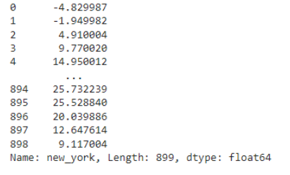
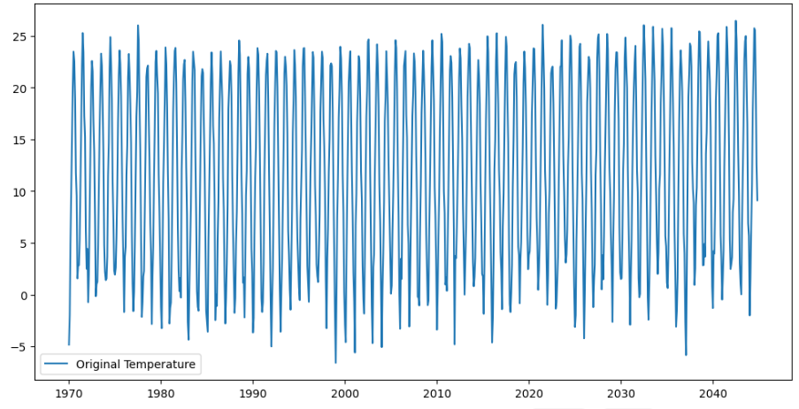
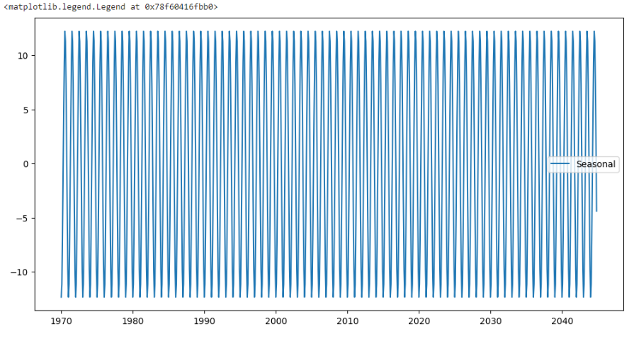
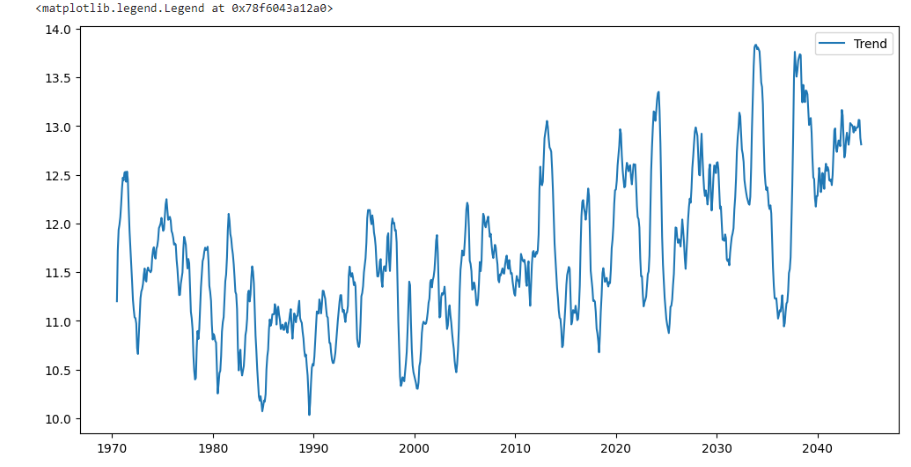
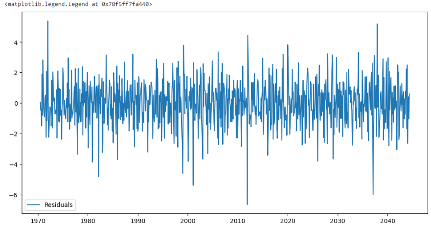

# Ex.No: 05  IMPLEMENTATION OF TIME SERIES ANALYSIS AND DECOMPOSITION
### Date: 


## AIM:
To Illustrates how to perform time series analysis and decomposition on the monthly average temperature of a city/country and for airline passengers.

## ALGORITHM:
1. Import the required packages like pandas and numpy
2. Read the data using the pandas
3. Perform the decomposition process for the required data.
4. Plot the data according to need, either seasonal_decomposition or trend plot.
5. Display the overall results.

## PROGRAM:
```
import pandas as pd
import numpy as np
import matplotlib.pyplot as plt
from statsmodels.tsa.seasonal import seasonal_decompose

df = pd.read_csv('US_City_Temp_Data.csv')

df.isnull().sum()

df['time'] = pd.to_datetime(df['time'])

temperature_data = df['new_york']

new_index = pd.date_range(start=temperature_data.index.min(), periods=len(temperature_data), freq='MS')[:len(temperature_data)]

temperature_data.index = new_index

decomposition = seasonal_decompose(temperature_data, model='additive')

# Extract trend, seasonal, and residuals components
trend = decomposition.trend
seasonal = decomposition.seasonal
residuals = decomposition.resid

# Original data
plt.figure(figsize=(12, 6))
plt.plot(temperature_data, label='Original Temperature')
plt.legend()

# Trend plot
plt.figure(figsize=(12, 6))
plt.plot(trend, label='Trend')
plt.legend()

# Seasonal plot (optional)
plt.figure(figsize=(12, 6))
plt.plot(seasonal, label='Seasonal')
plt.legend()

# Residuals plot (optional)
plt.figure(figsize=(12, 6))
plt.plot(residuals, label='Residuals')
plt.legend()
```

## OUTPUT:
### FIRST FIVE ROWS:


### PLOTTING THE DATA:


### SEASONAL PLOT REPRESENTATION :


### TREND PLOT REPRESENTATION :


### RESIDUAL PLOT  REPRESENTATION:


### RESULT:
Thus we have created the python code for the time series analysis and decomposition.
